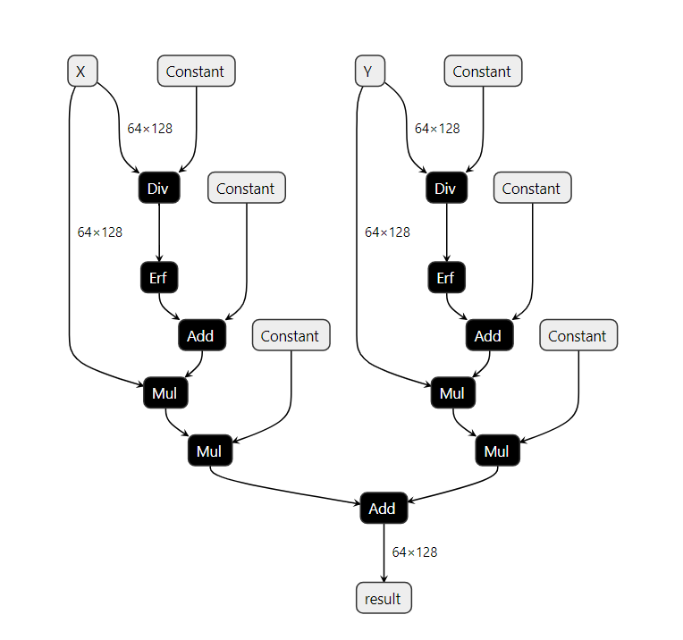
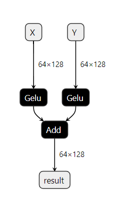
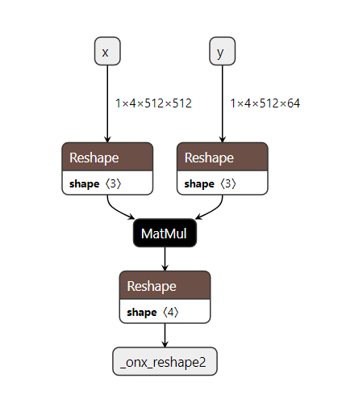

# Pattern-based Rewrite Using Rules

## Introduction

The ONNX Rewriter tool provides the user with the functionality to replace certain patterns in an ONNX graph with another pattern based on rewrite rules provided by the user.

## Usage

There are three main components needed when rewriting patterns in the graph:

1. `target_pattern` : Original pattern to match against. This pattern is written as a function using ONNXScript-like operators.
2. `replacement_pattern` : Pattern to replace the original pattern with. This pattern is also written as a function using ONNXScript-like operators.
3. `match_condition` (optional) : Pattern rewrite will occur only if the match condition is satisfied.

(heading-target-simple)=
## A Simple Example

An simple example demonstrating the usage of this functionality using the `GELU` activation function:

`GELU` activation function can be computed using a Gauss Error Function using the given formula:

<figure class="math">
<svg xmlns="http://www.w3.org/2000/svg" width="100%" height="auto" viewBox="0 -1342 19081.3 2028" xmlns:xlink="http://www.w3.org/1999/xlink" aria-hidden="true" style=""><defs><path id="MJX-7-TEX-N-47" d="M56 342Q56 428 89 500T174 615T283 681T391 705Q394 705 400 705T408 704Q499 704 569 636L582 624L612 663Q639 700 643 704Q644 704 647 704T653 705H657Q660 705 666 699V419L660 413H626Q620 419 619 430Q610 512 571 572T476 651Q457 658 426 658Q401 658 376 654T316 633T254 592T205 519T177 411Q173 369 173 335Q173 259 192 201T238 111T302 58T370 31T431 24Q478 24 513 45T559 100Q562 110 562 160V212Q561 213 557 216T551 220T542 223T526 225T502 226T463 227H437V273H449L609 270Q715 270 727 273H735V227H721Q674 227 668 215Q666 211 666 108V6Q660 0 657 0Q653 0 639 10Q617 25 600 42L587 54Q571 27 524 3T406 -22Q317 -22 238 22T108 151T56 342Z"></path><path id="MJX-7-TEX-N-45" d="M128 619Q121 626 117 628T101 631T58 634H25V680H597V676Q599 670 611 560T625 444V440H585V444Q584 447 582 465Q578 500 570 526T553 571T528 601T498 619T457 629T411 633T353 634Q266 634 251 633T233 622Q233 622 233 621Q232 619 232 497V376H286Q359 378 377 385Q413 401 416 469Q416 471 416 473V493H456V213H416V233Q415 268 408 288T383 317T349 328T297 330Q290 330 286 330H232V196V114Q232 57 237 52Q243 47 289 47H340H391Q428 47 452 50T505 62T552 92T584 146Q594 172 599 200T607 247T612 270V273H652V270Q651 267 632 137T610 3V0H25V46H58Q100 47 109 49T128 61V619Z"></path><path id="MJX-7-TEX-N-4C" d="M128 622Q121 629 117 631T101 634T58 637H25V683H36Q48 680 182 680Q324 680 348 683H360V637H333Q273 637 258 635T233 622L232 342V129Q232 57 237 52Q243 47 313 47Q384 47 410 53Q470 70 498 110T536 221Q536 226 537 238T540 261T542 272T562 273H582V268Q580 265 568 137T554 5V0H25V46H58Q100 47 109 49T128 61V622Z"></path><path id="MJX-7-TEX-N-55" d="M128 622Q121 629 117 631T101 634T58 637H25V683H36Q57 680 180 680Q315 680 324 683H335V637H302Q262 636 251 634T233 622L232 418V291Q232 189 240 145T280 67Q325 24 389 24Q454 24 506 64T571 183Q575 206 575 410V598Q569 608 565 613T541 627T489 637H472V683H481Q496 680 598 680T715 683H724V637H707Q634 633 622 598L621 399Q620 194 617 180Q617 179 615 171Q595 83 531 31T389 -22Q304 -22 226 33T130 192Q129 201 128 412V622Z"></path><path id="MJX-7-TEX-N-28" d="M94 250Q94 319 104 381T127 488T164 576T202 643T244 695T277 729T302 750H315H319Q333 750 333 741Q333 738 316 720T275 667T226 581T184 443T167 250T184 58T225 -81T274 -167T316 -220T333 -241Q333 -250 318 -250H315H302L274 -226Q180 -141 137 -14T94 250Z"></path><path id="MJX-7-TEX-I-1D465" d="M52 289Q59 331 106 386T222 442Q257 442 286 424T329 379Q371 442 430 442Q467 442 494 420T522 361Q522 332 508 314T481 292T458 288Q439 288 427 299T415 328Q415 374 465 391Q454 404 425 404Q412 404 406 402Q368 386 350 336Q290 115 290 78Q290 50 306 38T341 26Q378 26 414 59T463 140Q466 150 469 151T485 153H489Q504 153 504 145Q504 144 502 134Q486 77 440 33T333 -11Q263 -11 227 52Q186 -10 133 -10H127Q78 -10 57 16T35 71Q35 103 54 123T99 143Q142 143 142 101Q142 81 130 66T107 46T94 41L91 40Q91 39 97 36T113 29T132 26Q168 26 194 71Q203 87 217 139T245 247T261 313Q266 340 266 352Q266 380 251 392T217 404Q177 404 142 372T93 290Q91 281 88 280T72 278H58Q52 284 52 289Z"></path><path id="MJX-7-TEX-N-29" d="M60 749L64 750Q69 750 74 750H86L114 726Q208 641 251 514T294 250Q294 182 284 119T261 12T224 -76T186 -143T145 -194T113 -227T90 -246Q87 -249 86 -250H74Q66 -250 63 -250T58 -247T55 -238Q56 -237 66 -225Q221 -64 221 250T66 725Q56 737 55 738Q55 746 60 749Z"></path><path id="MJX-7-TEX-N-3D" d="M56 347Q56 360 70 367H707Q722 359 722 347Q722 336 708 328L390 327H72Q56 332 56 347ZM56 153Q56 168 72 173H708Q722 163 722 153Q722 140 707 133H70Q56 140 56 153Z"></path><path id="MJX-7-TEX-N-3A6" d="M312 622Q310 623 307 625T303 629T297 631T286 634T270 635T246 636T211 637H184V683H196Q220 680 361 680T526 683H538V637H511Q468 637 447 635T422 631T411 622V533L425 531Q525 519 595 466T665 342Q665 301 642 267T583 209T506 172T425 152L411 150V61Q417 55 421 53T447 48T511 46H538V0H526Q502 3 361 3T196 0H184V46H211Q231 46 245 46T270 47T286 48T297 51T303 54T307 57T312 61V150H310Q309 151 289 153T232 166T160 195Q149 201 136 210T103 238T69 284T56 342Q56 414 128 467T294 530Q309 532 310 533H312V622ZM170 342Q170 207 307 188H312V495H309Q301 495 282 491T231 469T186 423Q170 389 170 342ZM415 188Q487 199 519 236T551 342Q551 384 539 414T507 459T470 481T434 491T415 495H410V188H415Z"></path><path id="MJX-7-TEX-N-22C5" d="M78 250Q78 274 95 292T138 310Q162 310 180 294T199 251Q199 226 182 208T139 190T96 207T78 250Z"></path><path id="MJX-7-TEX-N-31" d="M213 578L200 573Q186 568 160 563T102 556H83V602H102Q149 604 189 617T245 641T273 663Q275 666 285 666Q294 666 302 660V361L303 61Q310 54 315 52T339 48T401 46H427V0H416Q395 3 257 3Q121 3 100 0H88V46H114Q136 46 152 46T177 47T193 50T201 52T207 57T213 61V578Z"></path><path id="MJX-7-TEX-N-32" d="M109 429Q82 429 66 447T50 491Q50 562 103 614T235 666Q326 666 387 610T449 465Q449 422 429 383T381 315T301 241Q265 210 201 149L142 93L218 92Q375 92 385 97Q392 99 409 186V189H449V186Q448 183 436 95T421 3V0H50V19V31Q50 38 56 46T86 81Q115 113 136 137Q145 147 170 174T204 211T233 244T261 278T284 308T305 340T320 369T333 401T340 431T343 464Q343 527 309 573T212 619Q179 619 154 602T119 569T109 550Q109 549 114 549Q132 549 151 535T170 489Q170 464 154 447T109 429Z"></path><path id="MJX-7-TEX-LO-5B" d="M224 -649V1150H455V1099H275V-598H455V-649H224Z"></path><path id="MJX-7-TEX-N-2B" d="M56 237T56 250T70 270H369V420L370 570Q380 583 389 583Q402 583 409 568V270H707Q722 262 722 250T707 230H409V-68Q401 -82 391 -82H389H387Q375 -82 369 -68V230H70Q56 237 56 250Z"></path><path id="MJX-7-TEX-N-65" d="M28 218Q28 273 48 318T98 391T163 433T229 448Q282 448 320 430T378 380T406 316T415 245Q415 238 408 231H126V216Q126 68 226 36Q246 30 270 30Q312 30 342 62Q359 79 369 104L379 128Q382 131 395 131H398Q415 131 415 121Q415 117 412 108Q393 53 349 21T250 -11Q155 -11 92 58T28 218ZM333 275Q322 403 238 411H236Q228 411 220 410T195 402T166 381T143 340T127 274V267H333V275Z"></path><path id="MJX-7-TEX-N-72" d="M36 46H50Q89 46 97 60V68Q97 77 97 91T98 122T98 161T98 203Q98 234 98 269T98 328L97 351Q94 370 83 376T38 385H20V408Q20 431 22 431L32 432Q42 433 60 434T96 436Q112 437 131 438T160 441T171 442H174V373Q213 441 271 441H277Q322 441 343 419T364 373Q364 352 351 337T313 322Q288 322 276 338T263 372Q263 381 265 388T270 400T273 405Q271 407 250 401Q234 393 226 386Q179 341 179 207V154Q179 141 179 127T179 101T180 81T180 66V61Q181 59 183 57T188 54T193 51T200 49T207 48T216 47T225 47T235 46T245 46H276V0H267Q249 3 140 3Q37 3 28 0H20V46H36Z"></path><path id="MJX-7-TEX-N-66" d="M273 0Q255 3 146 3Q43 3 34 0H26V46H42Q70 46 91 49Q99 52 103 60Q104 62 104 224V385H33V431H104V497L105 564L107 574Q126 639 171 668T266 704Q267 704 275 704T289 705Q330 702 351 679T372 627Q372 604 358 590T321 576T284 590T270 627Q270 647 288 667H284Q280 668 273 668Q245 668 223 647T189 592Q183 572 182 497V431H293V385H185V225Q185 63 186 61T189 57T194 54T199 51T206 49T213 48T222 47T231 47T241 46T251 46H282V0H273Z"></path><path id="MJX-7-TEX-N-2F" d="M423 750Q432 750 438 744T444 730Q444 725 271 248T92 -240Q85 -250 75 -250Q68 -250 62 -245T56 -231Q56 -221 230 257T407 740Q411 750 423 750Z"></path><path id="MJX-7-TEX-N-221A" d="M95 178Q89 178 81 186T72 200T103 230T169 280T207 309Q209 311 212 311H213Q219 311 227 294T281 177Q300 134 312 108L397 -77Q398 -77 501 136T707 565T814 786Q820 800 834 800Q841 800 846 794T853 782V776L620 293L385 -193Q381 -200 366 -200Q357 -200 354 -197Q352 -195 256 15L160 225L144 214Q129 202 113 190T95 178Z"></path><path id="MJX-7-TEX-LO-5D" d="M16 1099V1150H247V-649H16V-598H196V1099H16Z"></path></defs><g stroke="currentColor" fill="currentColor" stroke-width="0" transform="scale(1,-1)"><g data-mml-node="math"><g data-mml-node="mtext"><use data-c="47" xlink:href="#MJX-7-TEX-N-47"></use><use data-c="45" xlink:href="#MJX-7-TEX-N-45" transform="translate(785,0)"></use><use data-c="4C" xlink:href="#MJX-7-TEX-N-4C" transform="translate(1466,0)"></use><use data-c="55" xlink:href="#MJX-7-TEX-N-55" transform="translate(2091,0)"></use></g><g data-mml-node="mrow" transform="translate(3007.7,0)"><g data-mml-node="mo"><use data-c="28" xlink:href="#MJX-7-TEX-N-28"></use></g><g data-mml-node="mi" transform="translate(389,0)"><use data-c="1D465" xlink:href="#MJX-7-TEX-I-1D465"></use></g><g data-mml-node="mo" transform="translate(961,0)"><use data-c="29" xlink:href="#MJX-7-TEX-N-29"></use></g></g><g data-mml-node="mo" transform="translate(4635.4,0)"><use data-c="3D" xlink:href="#MJX-7-TEX-N-3D"></use></g><g data-mml-node="mi" transform="translate(5691.2,0)"><use data-c="1D465" xlink:href="#MJX-7-TEX-I-1D465"></use></g><g data-mml-node="mi" transform="translate(6263.2,0)"><use data-c="3A6" xlink:href="#MJX-7-TEX-N-3A6"></use></g><g data-mml-node="mrow" transform="translate(7151.9,0)"><g data-mml-node="mo"><use data-c="28" xlink:href="#MJX-7-TEX-N-28"></use></g><g data-mml-node="mi" transform="translate(389,0)"><use data-c="1D465" xlink:href="#MJX-7-TEX-I-1D465"></use></g><g data-mml-node="mo" transform="translate(961,0)"><use data-c="29" xlink:href="#MJX-7-TEX-N-29"></use></g></g><g data-mml-node="mo" transform="translate(8779.7,0)"><use data-c="3D" xlink:href="#MJX-7-TEX-N-3D"></use></g><g data-mml-node="mi" transform="translate(9835.4,0)"><use data-c="1D465" xlink:href="#MJX-7-TEX-I-1D465"></use></g><g data-mml-node="mo" transform="translate(10629.7,0)"><use data-c="22C5" xlink:href="#MJX-7-TEX-N-22C5"></use></g><g data-mml-node="mfrac" transform="translate(11129.9,0)"><g data-mml-node="mn" transform="translate(220,676)"><use data-c="31" xlink:href="#MJX-7-TEX-N-31"></use></g><g data-mml-node="mn" transform="translate(220,-686)"><use data-c="32" xlink:href="#MJX-7-TEX-N-32"></use></g><rect width="700" height="60" x="120" y="220"></rect></g><g data-mml-node="mrow" transform="translate(12069.9,0)"><g data-mml-node="mo" transform="translate(0 -0.5)"><use data-c="5B" xlink:href="#MJX-7-TEX-LO-5B"></use></g><g data-mml-node="mn" transform="translate(472,0)"><use data-c="31" xlink:href="#MJX-7-TEX-N-31"></use></g><g data-mml-node="mo" transform="translate(1194.2,0)"><use data-c="2B" xlink:href="#MJX-7-TEX-N-2B"></use></g><g data-mml-node="mtext" transform="translate(2194.4,0)"><use data-c="65" xlink:href="#MJX-7-TEX-N-65"></use><use data-c="72" xlink:href="#MJX-7-TEX-N-72" transform="translate(444,0)"></use><use data-c="66" xlink:href="#MJX-7-TEX-N-66" transform="translate(836,0)"></use></g><g data-mml-node="mo" transform="translate(3336.4,0)"><use data-c="28" xlink:href="#MJX-7-TEX-N-28"></use></g><g data-mml-node="mi" transform="translate(3725.4,0)"><use data-c="1D465" xlink:href="#MJX-7-TEX-I-1D465"></use></g><g data-mml-node="TeXAtom" data-mjx-texclass="ORD" transform="translate(4297.4,0)"><g data-mml-node="mo"><use data-c="2F" xlink:href="#MJX-7-TEX-N-2F"></use></g></g><g data-mml-node="msqrt" transform="translate(4797.4,0)"><g transform="translate(853,0)"><g data-mml-node="mn"><use data-c="32" xlink:href="#MJX-7-TEX-N-32"></use></g></g><g data-mml-node="mo" transform="translate(0,148.3)"><use data-c="221A" xlink:href="#MJX-7-TEX-N-221A"></use></g><rect width="500" height="60" x="853" y="888.3"></rect></g><g data-mml-node="mo" transform="translate(6150.4,0)"><use data-c="29" xlink:href="#MJX-7-TEX-N-29"></use></g><g data-mml-node="mo" transform="translate(6539.4,0) translate(0 -0.5)"><use data-c="5D" xlink:href="#MJX-7-TEX-LO-5D"></use></g></g></g></g></svg>
</figure>

We will show how we can find a subgraph matching this computation and replace it by a call to the function.

Firstly, include all the rewriter relevant imports.

```python
    from onnxscript.rewriter import pattern
    op = pattern.onnxop
```

Then create a target pattern that needs to be replaced using onnxscript operators.

```{literalinclude} examples/erfgelu.py
:pyobject: erf_gelu_pattern
```

After this, create a replacement pattern that consists of the GELU onnxscript operator

```python
    msft_op = pattern.msft_op
```
```{literalinclude} examples/erfgelu.py
:pyobject: gelu
```

For this example, we do not require a `match_condition` so that option is skipped for now. Then the rewrite rule is created using the `RewriteRule` function.

```python
    rule = pattern.RewriteRule(
        erf_gelu_pattern,  # Target Pattern
        gelu,  # Replacement Pattern
    )
```

Now that the rewrite rule has been created, the next step is to apply these pattern-based rewrite rules. The `rewriter.rewrite` call consists of three main components:

1. `model` : The original model on which the pattern rewrite rules are to be applied. This is of type `onnx.ModelProto`.
2. `function_rewrite_rules` : `(Optional)` This parameter is used to pass rewrite rules based on function names. Steps on how to use this parameter will be covered in a different tutorial. This parameter is of type `Sequence[type[FunctionRewriteRule]]`
3. `pattern_rewrite_rules` : `(Optional)` This parameter is used to pass rewrite rules based on a provided replacement pattern. For the purpose of this tutorial, we will be using only this parameter in conjunction with `model`. This parameter is of either one of these types:
    - `Sequence[PatternRewriteRule]`
    - `RewriteRuleSet`

:::{note}
:name: pattern_rewrite_rules input formatting

`pattern_rewrite_rules` takes a sequence of `PatternRewriteRule` types or a RewriteRuleSet which is also essentially a rule set created using a sequence of `PatternRewriteRule` types, so if only a singular rewrite rule is to be passed, it needs to passed as part of a sequence. For steps on how to create and use Rule-sets, refer to the example in the section [Creating a rule-set with different patterns](#heading-target-commute-ruleset).
:::

The snippet below below demonstrates how to use the `rewriter.rewrite` call for the rewrite rule created above:

```{literalinclude} examples/erfgelu.py
:pyobject: apply_rewrite
```

The graph (on the left) consists of the target pattern before the rewrite rule is applied. Once the rewrite rule is applied, the graph (on the right) shows that the target pattern has been successfully replaced by a GELU node as intended.

 


(heading-target-commute)=
## Utilizing `commute` parameter for pattern-matching
Extending the previous [simple example](heading-target-simple), assumming a scenario where we have a graph with the following structure.

{align=center width=500px}

In this graph, there exist two node pattern that constitute a `GELU` op. However, there is a subtle difference between the two. Focusing on the parent `Mul` nodes in either patterns, the order of the input values being multiplied is switched.

{width=330px align=left} {width=330px align=center} 


If we utilize the same `target_pattern` created for the earlier [simple example](heading-target-simple) (shown below), only one of two `GELU` pattern will be matched.

```{literalinclude} examples/erfgelu.py
:pyobject: erf_gelu_pattern
```

```{image} examples/img/erfgelu_06_commute.png
:alt: The resulting graph after matching.
:width: 400px
:align: center
```

Only one of the patterns has been successfully matched and replaced by a `GELU` node. In order to rewrite both the existing patterns in the graph, there are two methods.

(heading-target-commute-ruleset)=
### 1. Creating a rule-set with different patterns.

This method requires creating two separate rules and packing them into either a sequence of `PatternRewriteRule`s or a `RewriteRuleSet`. Creating a `RewriteRuleSet` is the preferable option but either can be used. In order to create a `RewriteRuleSet` with multiple rules `rule1` and `rule2` for example:

```python
    from onnxscript.rewriter import pattern
    rewrite_rule_set = pattern.RewriteRuleSet(rules=[rule1, rule2])
```

In order to apply this method to the example above, first create the two separate target patterns as follows:

```{literalinclude} examples/erfgelu.py
:pyobject: erf_gelu_pattern
```
```{literalinclude} examples/erfgelu.py
:pyobject: erf_gelu_pattern_2
```

Then, create two separate `PatternRewriteRule`s, one for each target pattern. Pack these rules into a `RewriteRuleSet` object and apply rewrites by passing the created `RewriteRuleSet` for the `pattern_rewrite_rules` parameter.

```{literalinclude} examples/erfgelu.py
:pyobject: apply_rewrite_with_ruleset
```


### 2. Using the `commute` parameter while creating a rule.

Creating multiple target patterns for similar patterns can be tedious. In order to avoid this, the `commute` parameter can be utilized while creating the `RewriteRuleSet`. Simply set `commute=True` in order to avoid creating multiple target pattern for cases where patterns are different due to commutativity. Multiple rules with the different patterns emerging due to satisfying the commutativity property are automatically packed into a `RewriteRuleSet` object. Then apply rewrites by passing the created `RewriteRuleSet` for the `pattern_rewrite_rules` parameter.

```{literalinclude} examples/erfgelu.py
:pyobject: apply_rewrite_with_commute
```

For the both of the aforementioned methods, the final graph with both rewrites applied should look as follows:

{align=center width=300px}

## Using the `match_condition` parameter for pattern-matching

This section talks about how to utilize the `match_condition` parameter. The `match_condition` parameter checks if the pattern matches the target pattern with certain constraints in consideration.

Let us consider a model which consists of the following pattern.

{align=center}

Based on the [ONNX Matmul spec](https://github.com/onnx/onnx/blob/main/docs/Operators.md#MatMul), onnx `Matmul` behaves like `numpy.matmul` and also follows numpy broadcasting. So in this particular pattern if matmul broadcasting is enough, then we don't need the reshapes. To validate this, we need to check the following:

1. Input shapes check: `input_a` and `input_b` should be broadcastable
2. Output shape check: `shape_c` should be the same as the output shape from the `matmul(input_a, input_b)`

If the above are true, then we don't need the reshapes and we can eliminate them using a pattern based rewrite. In order to validate whether matmul broadcast is sufficient, we write a condition checking function as follows:

```{literalinclude} examples/broadcast_matmul.py
:pyobject: check_if_need_reshape
```

Once we have the `match_condition` function, we can write a target pattern and replacement pattern in a similar way to the first example.

```{literalinclude} examples/broadcast_matmul.py
:pyobject: two_reshapes_matmul_reshape_pattern
```

```{literalinclude} examples/broadcast_matmul.py
:pyobject: matmul
```

With all the necessary components in place, the pattern rewrite rule with the `match_condition` function is created and then the `rewriter.rewrite` is called to apply the rewrite.

```{literalinclude} examples/broadcast_matmul.py
:pyobject: apply_rewrite
```
